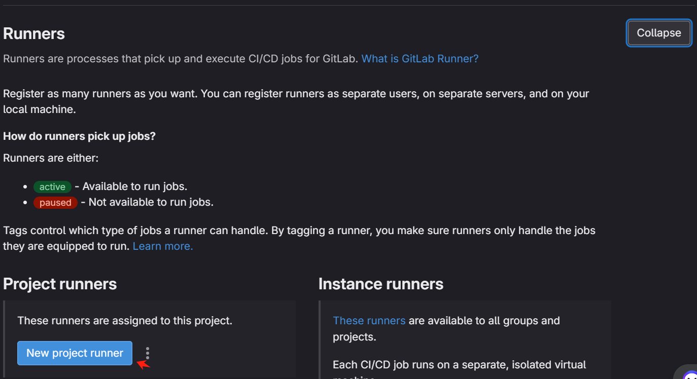

# Install Gitlab Runner on Raspberry pi

## Download package for Ubuntu

```bash
curl -LJO "https://s3.dualstack.us-east-1.amazonaws.com/gitlab-runner-downloads/latest/deb/gitlab-runner_arm64.deb"
```

## Install

```bash
sudo dpkg -i gitlab-runner_arm64.deb
```

## Register with a runner authentication token

1. Run the register command
```bash
sudo gitlab-runner register -n --url https://gitlab.com --registration-token [token-key-xxx] --executor docker --description "Deployment Runner" --docker-image "docker:stable" --tag-list deployment --docker-privileged

```

2. Edit /etc/gitlab-runner/config.toml

```bash
sudo vi /etc/gitlab-runner/config.toml
#append volumes = ["/cache","/var/run/docker.sock:/var/run/docker.sock"]
sudo systemctl restart gitlab-runner
```
3. Open CI/CD Settings and create "new project runner"





Click "Create runner"