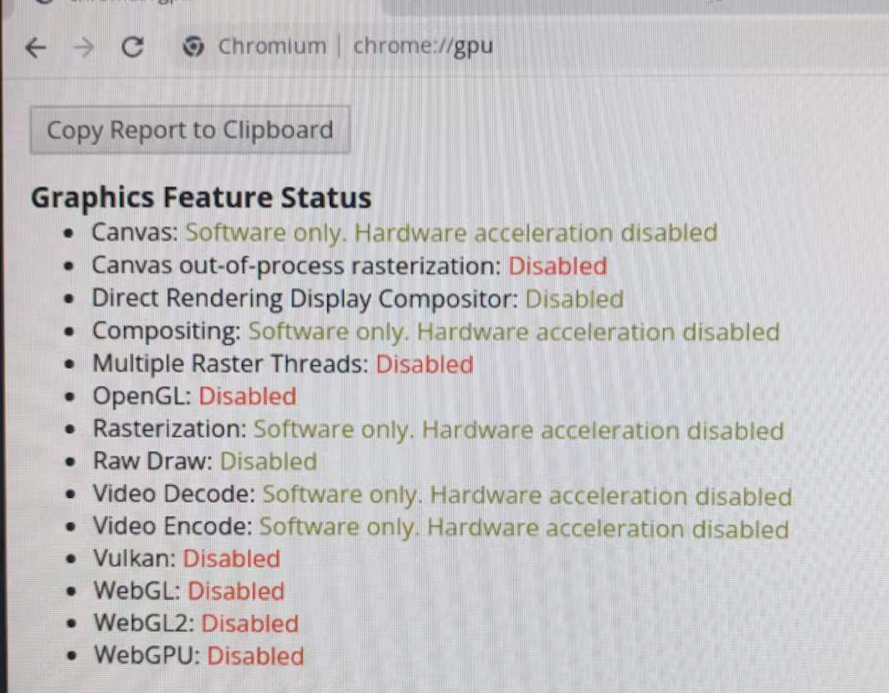
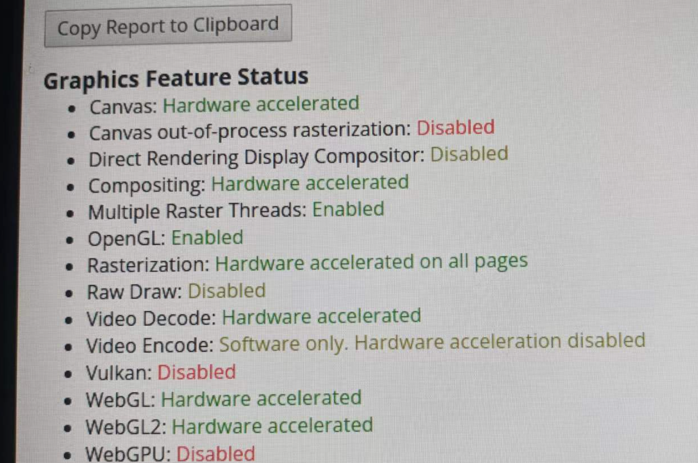

# alpine 安装


## 为什么选择alpine

alpine被docker广泛使用,系统盘只有150M,轻量级操作系统,作为数字标牌终端系统也是一个不错的选择,本文档记录alpine安装过程,记录如何实现浏览器自启动，记录浏览器硬件加速以便实现视频播放更好体验,内容结尾记录如果将制作好的系统盘快速复制实现快速部署.

## 制作启动盘

* 格式化TF卡为FAT32
* raspberry pi 4 选择 [alpine-rpi-3.16.2-aarch64.tar.gz下载](https://dl-cdn.alpinelinux.org/alpine/v3.16/releases/aarch64/alpine-rpi-3.16.2-aarch64.tar.gz "alpine linux iso下载")
* 解压alpine-rpi-3.16.2-aarch64.tar.gz文件, copy解压内容到tf卡

## 系统启动快速配置

将tf卡插入树莓派tf卡插槽上电启动系统，默认账号是root，不用输入密码回车及进入系统

一下将系统配置成"sys"模式，以后增加一篇关于"diskless"模式的文字

### setup-alpine

登录系统后执行 setup-apline 命令根据系统问答执行

```bash
Select keyboard layout: us
Available varients: us
Enter system hostname: alpine
[eth0] enter
[dhcp] enter
[wlan0] enter
Available wireless network(scanning):
xx-5G
...
Type the wireless network name to connecto to: xx-5G
Type the "xx-5G" network Preshared Key: password
[dhcp]:enter
Do you want to do any manual network configuration? (y/n) [n] enter
Change password for root
New password:
timezone:Asia/Shanghai
proxy:enter
NTP:enter
#f:fast
Enter mirror number (r/f/c/down):f
loginname:enter
disks:mmcblk0
How would you like to use it? sys
#选择sys模式不需要用lbu_commit -d 保存内存数据
```

### 管理软件

```bash
apk update && apk upgrade
```

### 配置ssh

```bash
vi /etc/ssh/sshd_config
```

```ini
PermitRootLogin yes
PasswordAuthentication yes
PermitEmptyPasswords no
```
#重新启动ssh
```bash
service sshd restart
```

### 远程登录配置树莓派

```bash
ssh root@ip
```

### 更新sourcelist

```bash
vi /etc/apk/repositories
```

```ini
#/media/mmcblk0p1/apks
http://mirrors.bfsu.edu.cn/alpine/v3.16/main
http://mirrors.bfsu.edu.cn/alpine/v3.16/community
http://mirrors.bfsu.edu.cn/alpine/edge/main
http://mirrors.bfsu.edu.cn/alpine/edge/community
http://mirrors.bfsu.edu.cn/alpine/edge/testing
```

```bash
apk update
```

### 安装X11

```bash
setup-xorg-base
```

### 配置GPU

```bash
cat <<EOF > /media/mmcblk0p1/usercfg.txt
dtoverlay=vc4-kms-v3d-pi4
gpu_mem=256
hdmi_enable_4kp60=1
EOF
```

 rc-update: service `hwdriver' is not in the runlevel `sysinit'
### 创建用户

```bash
#h:home directory
#添加新用户user,并将/srv目录作为home目录
adduser -h /srv user
#-R:recurse
# 将目录srv所有权赋予user
chown -R user /srv
# 7表示目录所有者拥有多写执行的权利，其他用户只有执行权力,ref:https://chmodcommand.com/chmod-701/
chmod 701 /srv
```

#### 配置自启动

```bash
vi /etc/inittab
#打开inittab,修改user用户自动启动
```

```ini
tty1::respawn:/bin/login -f user
```

### 安装chromium

```bash
apk add chromium
#创建x11自启动
cat <<EOF > /srv/.profile
#!/bin/sh
#start x server
exec startx
EOF
#自启动浏览器
cat <<EOF > /srv/.xinitrc
#!/bin/sh

# turn off screensaver
xset -dpms
xset s off
xset s noblank


# screen size
width="1920"
height="1080"

# url
url="//srv/sum.mp4

<<<<<<< HEAD
#exec chromium-browser $url --window-size=2560,1440 --window-position=0,0 --full-screen --enable-webgl --ignore-gpu-blacklist

midori -e Fullscreen -a http://localhost
=======
exec chromium-browser $url --window-size=$width,$height --window-position=0,0 --kiosk --no-sandbox --full-screen --incognito --noerrdialogs --disable-translate --no-first-run --fast --fast-start --ignore-gpu-blacklist --disable-quic --enable-fast-unload --enable-tcp-fast-open --enable-native-gpu-memory-buffers --enable-gpu-rasterization --enable-zero-copy --disable-infobars --disable-features=TranslateUI --disk-cache-dir=/tmp --enable-features=VaapiVideoEncoder,VaapiVideoDecoder,CanvasOopRasterization 
>>>>>>> 433d49b48f97ebfbf64ccf9972b1d27e4f28efc4

EOF

```

#### 硬件加速

浏览器打开chrome://gpu,如下图所示



```bash
#安装硬件加速驱动
apk add mesa-dri-vc4 mesa-egl  dbus setxkbmap kbd xrandr xset
 ls -la /dev/dri
 lsmod
 #重点：一定执行下面的命令， 否则1080p,30f都无法流畅播放, 4k视频播放很卡，浏览器这方面支持很弱
 apk update && apk upgrade
 # 经过测试，增加一下包都视频播放都无效果
#Vukan:Enabled
#apk add vulkan-loader mesa-vulkan-broadcom
#vpxvideodecorder
#apk add libvpx libvpx-utils libvpx-dev
#dav1dVideoDecoder
#apk add dav1d libdav1d dav1d-dev
```


#### 安装特定版本库
```bash
apk add mesa-dri-gallium=22.1.7-r4
```

#### 支持鼠标
```bash
#注意在同一行加入用空格隔开，不能换行
usbhid.mousepoll=0
```

#### 支持中文字体

```bash
apk add wqy-zenhei --update-cache --repository https://nl.alpinelinux.org/alpine/edge/testing
#加几种字体配用
#https://gist.github.com/mezcel/ff833a444f2671879b22e76aa4ed61c5
apk add ttf-font-awesome ttf-hack ttf-inconsolata font-inconsolata-nerd
```

#### 查看cpu温度
```bash
apk add lm-sensors lm-sensors-detect
sensors
```

### 复制已经配置好的系统盘

#### 磁盘检查

```bash
#执行lsblk,可以看到2个分区,只要将这2个分区备份就可以了
lsblk

NAME        MAJ:MIN RM  SIZE RO TYPE MOUNTPOINTS
mmcblk0     179:0    0 29.1G  0 disk
├─mmcblk0p1 179:1    0  100M  0 part /boot
└─mmcblk0p2 179:2    0   29G  0 part /

```


#### 复制